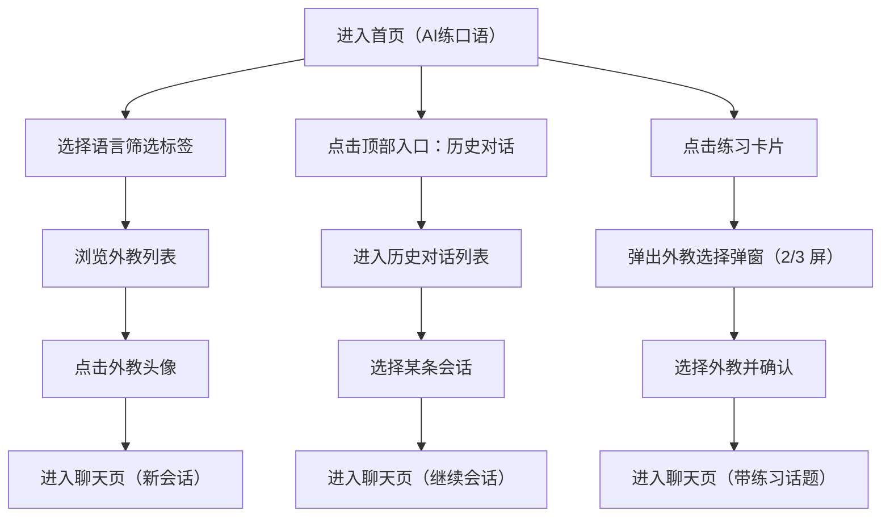

## 1. 产品概述
做一款用于演示的“AI练口语”小程序风格原型，通过 mock 数据拟真展示首页挑选外教、入口导航与对话练习的关键体验，便于倒推出 PRD。
- 目标用户：有口语练习需求的语言学习者、需要向他人演示产品概念的团队/个人
- 核心价值：低成本呈现可点击可交互的完整体验，支持路演/评审/需求澄清

## 2. 核心功能

### 2.1 功能模块
1. **首页（AI练口语）**：外教语言筛选、外教横滑列表、快捷入口、智能对话练习卡片列表、TabBar
2. **历史对话列表**：查看会话历史、继续进入某个会话
3. **聊天页**：与外教进行多轮对话（mock 消息流）、基础状态（发送中/失败重试/加载）
4. **外教选择弹窗（2/3 屏）**：从练习卡片进入前，先选择外教后开始聊天
5. **占位页**：AI背单词 / 视频 / 我的（用于 TabBar 可点击演示，后续逐步完善）

### 2.2 页面明细
| 页面名称 | 模块名称 | 功能说明 |
|---|---|---|
| 首页 | 顶部栏 | 标题“AI练口语”，左侧入口进入历史对话列表 |
| 首页 | 外教语言筛选 | 标签：全部/英语/日语/法语/德语/西班牙语/葡萄牙语；切换后外教列表随之变化 |
| 首页 | 外教列表 | 横向滚动；展示头像、姓名、灰色能力标签；点击外教直接进入聊天页（无详情页） |
| 首页 | 外教“全部”入口 | 预留入口（本阶段可做 toast 或占位页） |
| 首页 | 快捷入口 | AI背单词/视频课程/AI工具（本阶段跳转占位页） |
| 首页 | 智能对话练习 | 分类标签（场景实战/辩论比赛/话题探讨），卡片列表随分类切换 |
| 首页 | 练习卡片 | 点击弹出 2/3 屏外教选择弹窗；选中外教后进入聊天页并带入“练习话题”上下文 |
| 历史对话列表 | 会话列表 | 展示最近会话、时间、最后一条消息摘要；点击进入聊天页 |
| 聊天页 | 消息流 | 发送文本、展示 AI 回复、支持 mock“正在输入”与简单纠错提示卡片 |
| 外教选择弹窗 | 外教列表 | 从可用外教中选择一个（支持语言筛选复用）；确认后进入聊天页 |
| 占位页 | 基础展示 | 简单说明“后续完善”，用于演示导航可用 |

## 3. 核心流程
主流程 1：用户在首页通过语言筛选找到合适外教，点击外教头像直接进入聊天页开始对话。  
主流程 2：用户从首页点击练习卡片，先在 2/3 屏外教选择弹窗选择外教，然后进入聊天页并围绕该练习话题开始对话。  
辅助流程：用户通过顶部入口进入历史对话列表，选择历史会话继续聊天。

## 4. 用户界面设计
### 4.1 设计风格
- 总体：清爽教育风、小程序视觉语义（浅色背景、卡片分组、圆角、轻阴影）
- 颜色：浅灰背景 + 蓝色主色按钮/标签；强调色尽量克制
- 字体：移动端友好、层级清晰（标题/分组标题/正文/辅助说明 4 层即可）
- 布局：顶部栏 + 分组卡片 + 横滑列表 + TabBar；内容区可滚动
- 交互：点击反馈（按压态/涟漪或阴影变化），弹窗上滑出现，列表骨架屏（可选）

### 4.2 页面设计概览
| 页面名称 | 模块名称 | UI 元素 |
|---|---|---|
| 首页 | 外教语言筛选 | 横向胶囊标签；选中为实心主色，未选中为描边 |
| 首页 | 外教列表 | 圆形头像 + 名字 + 小灰字标签；横向滚动，末尾可留“全部”入口 |
| 首页 | 快捷入口 | 三个图标按钮（圆角矩形），行内排布 |
| 首页 | 智能对话练习 | 分类标签 + 卡片列表；卡片内含标题、描述、难度等信息 |
| 弹窗 | 外教选择 | 底部抽屉式 2/3 屏；顶部标题与关闭按钮；选择态高亮 |

### 4.3 响应式与适配
- 以手机端为主（375px 宽基准），同时在桌面浏览器中用“手机壳/画布”居中展示用于演示
- 触控优先：点击区域不小于 44px，高频区域提供明显按压反馈
