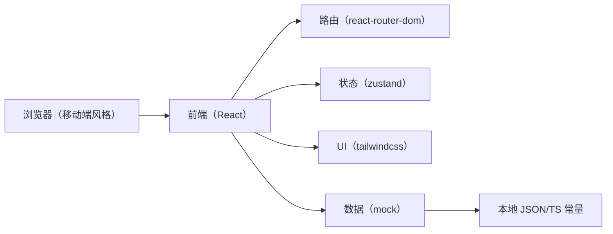
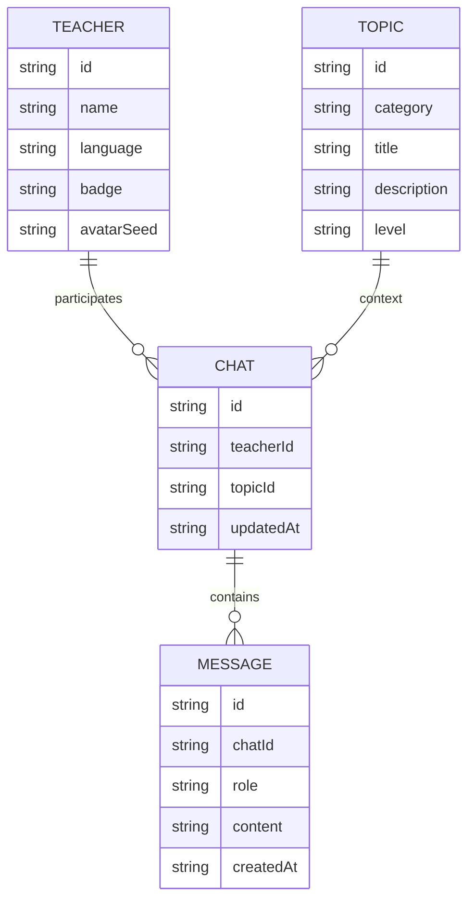

## 1. 架构设计

## 2. 技术选型说明
- 前端：React@18 + TypeScript + Vite
- 样式：tailwindcss@3
- 路由：react-router-dom
- 状态管理：zustand
- 后端：无（演示原型阶段全部使用 mock 数据）

## 3. 路由定义
| 路由 | 用途 |
|---|---|
| / | 首页（AI练口语） |
| /chats | 历史对话列表 |
| /chat/:chatId | 聊天页（继续会话） |
| /chat/new | 聊天页（新会话，可携带 teacherId/topicId） |
| /vocab | AI背单词占位页 |
| /videos | 视频占位页 |
| /me | 我的占位页 |

## 4. API 定义（无后端）
采用前端 mock：
- src/mocks/teachers.ts：外教列表与语言信息
- src/mocks/topics.ts：练习卡片列表（按分类）
- src/mocks/chats.ts：历史对话列表与消息流

## 5. 数据模型
### 5.1 数据模型定义

### 5.2 前端 TypeScript 类型（建议）
- Teacher：用于首页外教选择与弹窗选择
- Topic：用于首页练习卡片列表与分类切换
- Chat/Message：用于历史对话列表与聊天消息流
